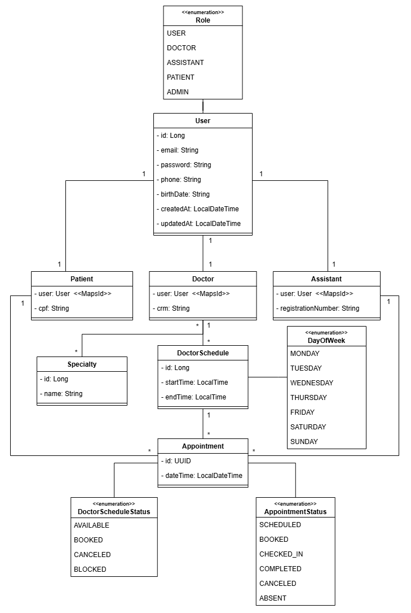
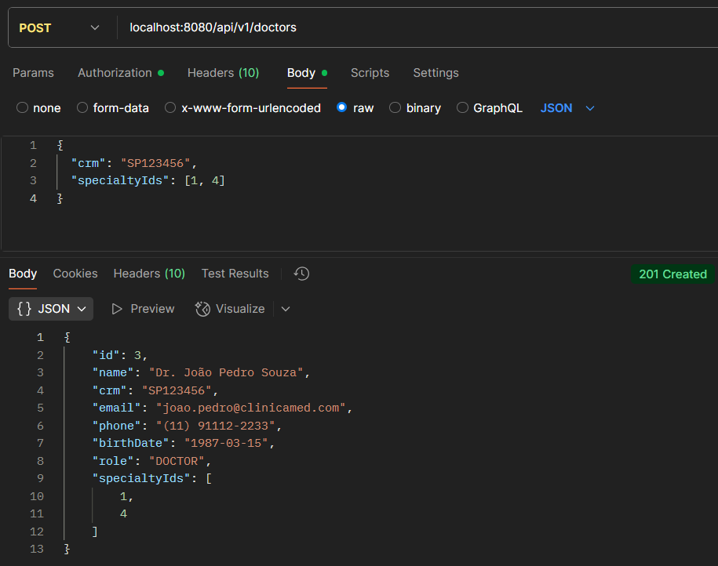
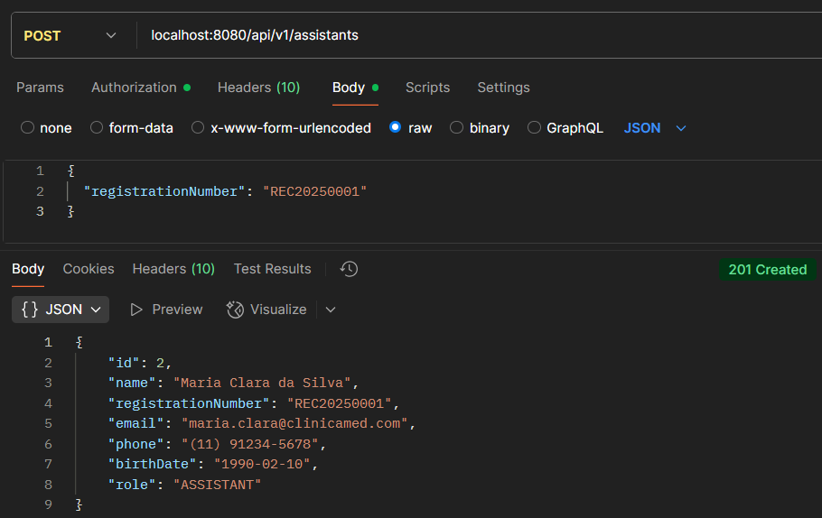
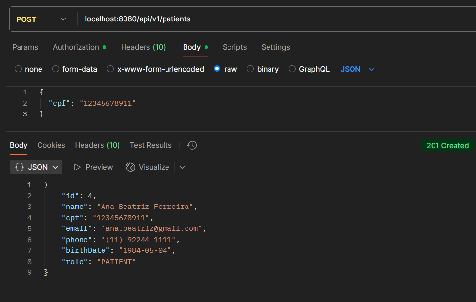
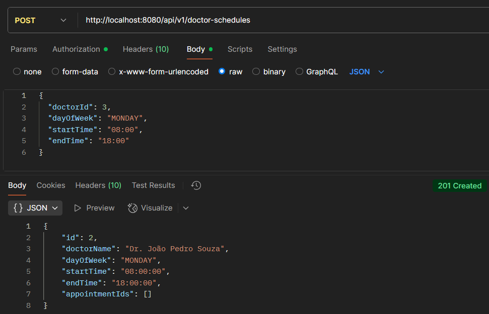
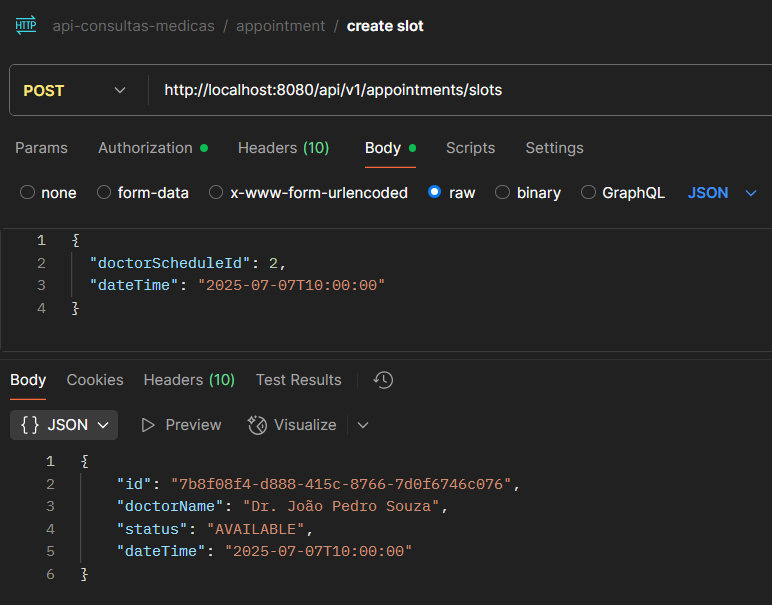
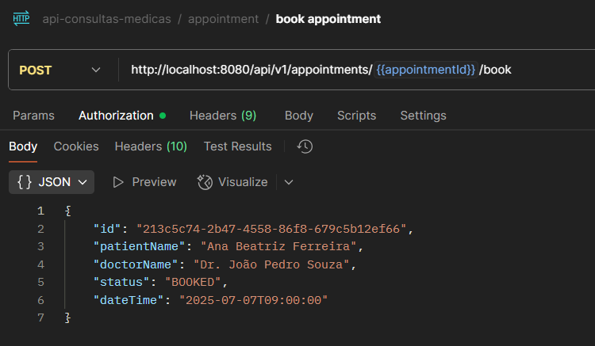
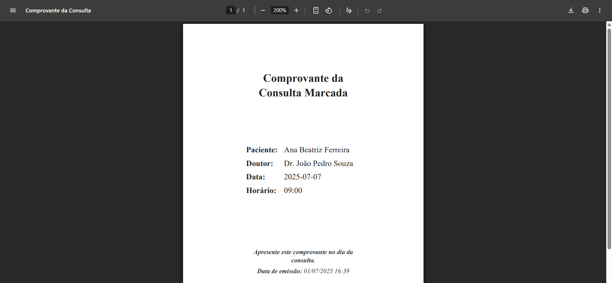
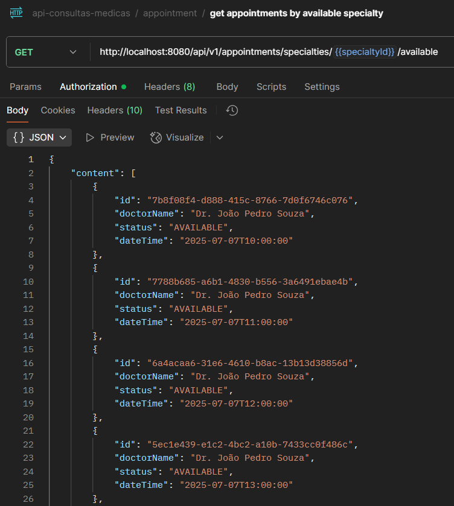

# 🏥 Sistema de Agendamento de Consultas Médicas

## 📄 Descrição

Este projeto é composto por duas APIs integradas:

**API de Consultas Médicas**: uma API REST que permite o agendamento de consultas, registrando informações como paciente, assistente, médico, consulta e horários de atendimento.

**API de Documentos**: responsável por gerar um comprovante em PDF com os dados da consulta, armazenando esse arquivo no AWS S3 Bucket, permitindo que o usuário possa acessar o documento posteriormente.

## ⚙️ Funcionalidades

- **Autenticação e autorização**: controle de acesso via JWT para pacientes, assistentes, médicos e administradores.
- **Cadastro e gerenciamento de usuários**: inclui pacientes, assistentes e médicos.
- **Agendamento de consultas**: respeitando a disponibilidade dos horários dos médicos.
- **Geração automática de documentos**: criação de comprovantes para os agendamentos realizados.
- **Armazenamento e acesso aos comprovantes**: arquivos PDF armazenados e acessados via AWS S3.

## 🛠️ Tecnologias

- **Linguagem**: Java
- **Framework**: Spring Boot
- **Gerenciador de Dependências**: Maven
- **Banco de Dados**: PostgreSQL, H2 Database
- **Migração de Banco**: Flyway DB
- **Segurança**: Spring Security, JWT Token
- **Mensageria**: RabbitMQ
- **Broker na Nuvem**: Cloud AMQP
- **Template Engine**: Thymeleaf
- **Geração de PDF**: ITextPDF
- **Armazenamento de Arquivos**: AWS S3
- **Testes**: JUnit, Mockito
- **Utilitários**: Lombok, MapStruct
- **Documentação da API**: SpringDoc OpenAPI

## 📝 Endpoints

- **Documentação online:**
  https://sistema-consultas-medicas.onrender.com/swagger-ui/index.html#/
- **Documentação local:**
  http://localhost:8080/swagger-ui/index.html

## 📈 Diagrama de Classes

<details>
    <summary><b>Diagrama de Classes</b></summary>
    
</details>

## 🗂️ Imagens do Projeto

<details>
  <summary><b>Criação de Usuários</b></summary>
  
  
  
</details>

<details>
  <summary><b>Criação de Cronograma do Médico</b></summary>
  
</details>

<details>
  <summary><b>Criação de Consulta</b></summary>
  
</details>

<details>
  <summary><b>Agendamento de Consulta</b></summary>
  
</details>

<details>
  <summary><b>Comprovante da Consulta Marcada</b></summary>
  
</details>

<details>
  <summary><b>Listagem de Consultas Disponíveis por Especialidade Médica</b></summary>
  
</details>

## ⚙️ Configuração e Execução

**Pré-requisitos**:

- Java 17
- Maven
- PostgreSQL
- RabbitMQ (CloudAMQP)
- Conta na AWS (Bucket S3)

**Passos para Configuração**:

1. Clone o repositório
2. Acesse o diretório do projeto
3. Configure o banco de dados no arquivo `application.yml` (URL, usuário, senha) das **duas APIs**
4. Configure o RabbitMQ (CloudAMQP) no arquivo `application.yml` das **duas APIs**
5. Configure a AWS S3 com suas credenciais no arquivo `application.yml` da **api-comprovantes**
6. Configure a secret key para JWT no arquivo `application.yml` da **api-consultas-medicas**

```bash
# Execute a aplicação
mvn spring-boot:run

# Pressione (CTRL + C) para encerrar a aplicação
```

## 🙋‍♀️ Autor

👩‍💻 Projeto desenvolvido por [Isabel Henrique](https://www.linkedin.com/in/isabel-henrique/)

🤝 Fique à vontade para contribuir!
